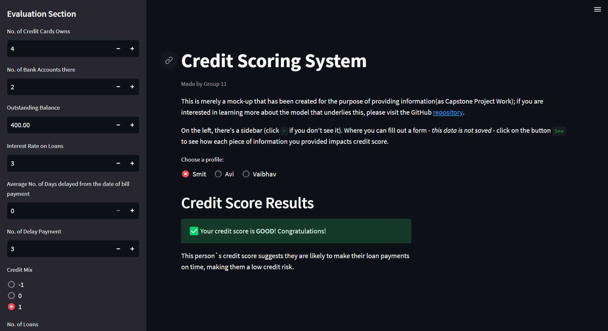

<h1 align="center">Credit Score Classification</h1>

At the present time, everyone needs to have good credit because it is seen as a sign of trustworthiness. Financial institutions and credit card issuers use credit scores to determine creditworthiness. It enables banks and credit card companies to issue loans to customers with excellent creditworthiness immediately. 

In today's fast-paced world, doing a manual investigation into each portfolio and generating a credit report both take a significant amount of time. Most of the banks and credit card companies use Machine Learning algorithms to categorize all their customers based on their credit history.

We made a classification system for credit scores to get rid of having to do work by hand. Based on banking data, it is possible to put people into three groups: excellent, standard, and poor. 

We took data from Statso. It is a Data Science Community to Find Case Studies, Datasets and more. This site generates and compiles data from many online sources, and its authors then use this information to develop case studies that show how various types of data can be used to address specific problems.

Data : https://statso.io/credit-score-classification-case-study/

Workflow :

  

## Data Cleaning and Preparation
- We removed the ID, Customer_ID, Name, and SSN fields from the dataset because they were irrelevant. We iterate through the dataset and replace any odd numbers, weird digits and undesirable symbolic patterns with nulls. 

- There was a column with the name 'Credit_History_Age' that contained data in the format "XX years and XX months", which was irrelevant for analysis and ML modelling. Thus, we converted those columns to months only.

- Then, we partition the column operation into two categories: numerical and categorical. For categorical NA values, the customer's most recent non-null value will be used to attempt to update the NA. The mean value of the variable is substituted for null values  in numerical ones.

  

## Descriptive Statistics 
- Descriptive statistics were utilized for each column of data. And what we discovered was that some of the values in it were completely worthless, while others were much farther away from most of the data points. They are referred to as outliers.

- We resolve on a particular range for the variable's possible values after consulting a variety of sources. The number of credit cards, bank accounts, credit inquiries, and loans that an individual may possess. This stage is performed to make data meaningful because their values were excessively high. In the end, we apply the label encoder to the text-based column in order to get our data ready to fit into the model.

  

## Exploratory Data Analysis

1. Individuals with an extended credit history tend to attain higher credit ratings.

  

2. The most significant harm to your credit score occurs when you make a payment after the due date of the billing cycle has elapsed.

  

3. The decrease in your credit score is directly proportional to the number of credit inquiries made.

  

## Scaling Data

- By looking at the correlation matrix, we can quickly see if any two features have a strong positive or negative correlation (close to 1 or -1, respectively), which means they are highly linearly dependent on each other.
- Some machine learning algorithms believe that features are independent, so this can be a problem. Having features that are highly related to each other can cause the model to overfit or reduced model performance.
- We use MinMax Scaler prior to fitting the data to the model. It scales the features of a dataset to a predetermined range, typically between 0 and 1, by subtracting the minimum value of each feature and dividing by the feature's range.
- It can improve the performance of specific machine learning algorithms and make it simpler to compare the relative significance of various features.

  

## Machine Learning

- We have Multiclass classification Problem. This problem could entail classifying credit score into three distinct categories, such as "poor," "standard" and "good." In this situation, we are working with a multiclass classification problem, hence we cannot utilize a binary classification metrics. 

- Accuracy, Confusion Matrix, Correlation Plot, and F1 Score are going to be the performance measurements that we use.

- We have utilized the following seven classifiers : Random Forest, Decision Tree, XGBoost, AdaBoost, KNN, and Logistic Regression. Voting has also been utilized. For each, we used the performance indicators that were discussed above and plotted the prediction pattern and a feature significance graph.

- This gives us the ability to select the model that will work best for integrating it into the production environment so that it can make predictions based on new data as it is being collected. 

  

## Model Deployment and Integration

- According to the performance metric that we presented, the Random Forest Classifier was the most effective model for the data. The Random Forest model and the MinMax model are both exported into the.obj format.

- This format makes it possible to save the trained model on a drive and then load it back into memory whenever it's required. It is easy to integrate with other applications and may be used to deliver the trained model to production environments where it can be used

- In this section of the ML model, we additionally export Scaler because, in the event that the application receives input from the real world, we will need to scale those values down before feeding them to the Random Forest model.

  

The Resp {} begins by gathering data from the real world, after which scaler scales this data down, draws conclusions from the model, and generates output .

  

## Streamlit Web Application:

  

## Challenges

Faced with challenges that are comparable to dummy data: 
- Data preprocessing: we require extensive preprocessing, including feature scaling, feature engineering, and outlier detection, to prepare the data for analysis.
- Missing data: we had missing and bogus values, which influenced  analysis.
- Imbalanced classes: one class has few samples. This can skew data and forecasts.
- Overfitting: data has many characteristics, which may overfit the model to the training data and perform poorly on new data.
- Model selection: it requires careful consideration of the best model for the classification task, as certain models are better for particular types of data than others.

## Let's review what our insights says :

When calculating credit scores, Neither FICO nor Our System consider :
- Age, SSN, ethnicity, color, religion, national origin, sex, or marital status. 
- Additionally, no to salary, profession, employer, date of employment, and employment history

In summary, maintaining a higher credit rating is closely tied to having a lengthy credit history. However, any delays in payment and a higher number of credit inquiries can have adverse effects on your credit score. The most significant negative impact occurs when payments are made after the due date of the billing cycle, and the degree of credit score reduction is directly proportional to the number of credit inquiries made. Therefore, consistent on-time payments and minimizing credit inquiries are key factors in preserving and improving one's creditworthiness.

  

## Contact

Author: Smit Rana

LinkedIn: https://www.linkedin.com/in/smit98rana/

        

